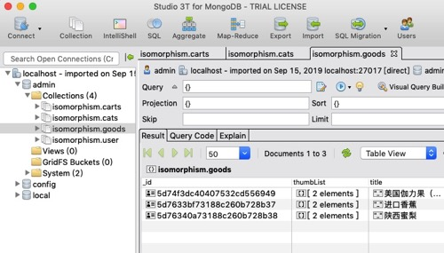

## Nuxt.js and Nest.js isomorphism project

<p>Nuxt 和 Nest 集成示例工程, UI层使用 Vant框架实现</p>

## 1.前置条件 

#### MongoDB   

> 工程中使用到了 MongoDB,需先在本地安装该服务 

[MongoDB 安装教程](https://docs.mongodb.com/manual/installation/)

> 安装完成后使用以下命令启动: 

```js
mongod --config mongod配置目录/mongod.conf --dbpath 数据库存放目录 

例如: 
mongod --config /usr/local/etc/mongod.conf --dbpath /usr/local/mongodir
```

<br/>

#### Charles 

> 对接接口时借助 Charles 抓包析工具能提升开发效率和快速定位问题,请注意 Charles 端口是否已设置为 8888(默认值)

[Charles Web Debugging Proxy](https://www.charlesproxy.com/)

<br/>

## 2.开发环境运行

```js
npm run client:prod				// local start on production mode

npm run client:dev				// local start on development mode

visit: http://localhost:8088
```

## 3.生产环境运行

```js
npm run build

and

cross-env NODE_ENV=production npm run start     // server start on production mode

cross-env NODE_ENV=development npm run start    // server start on development mode
```

## 4.目录结构

```js
client ---The client side source code folder, write Vue.js logical
here
 |-------- assets
 |-------- components
 |-------- layouts
 |-------- middleware
 |-------- pages
 |-------- plugins
 |-------- static
 |-------- store

server --- The server side(Node.js) logical here
 |-------- main.ts
 |-------- app.module.ts
 |-------- app.controller.ts
 |-------- common
             |--------- decorators
             |--------- filters
             |--------- guards
             |--------- interceptors
             |--------- middleware
             |--------- nuxt
             |--------- pipes
 |-------- routers
 |-------- modules
             |--------- modeule A..
             |--------- modeule B..
             |--------- modeule C..
             |--------- modeule D..
```

## 5.DataBase Proview


<br/>

## 6.Frameworks 

> [Vant - Mobile UI Components built on Vue](https://youzan.github.io/vant/#/zh-CN/intro)

> [Nest.js - A progressive Node.js framework for building efficient, reliable and scalable server-side applications.](https://nestjs.com/)

> [Nuxt.js - The Vue.js Framework](https://nuxtjs.org/)

## 7.Plugins

> [Nuxt-property-decorator](https://github.com/nuxt-community/nuxt-property-decorator)

> [Vue class component](https://github.com/vuejs/vue-class-component)

> [Vuex class](https://github.com/ktsn/vuex-class/)

> [Nuxt class component](https://github.com/nuxt-community/nuxt-class-component)
